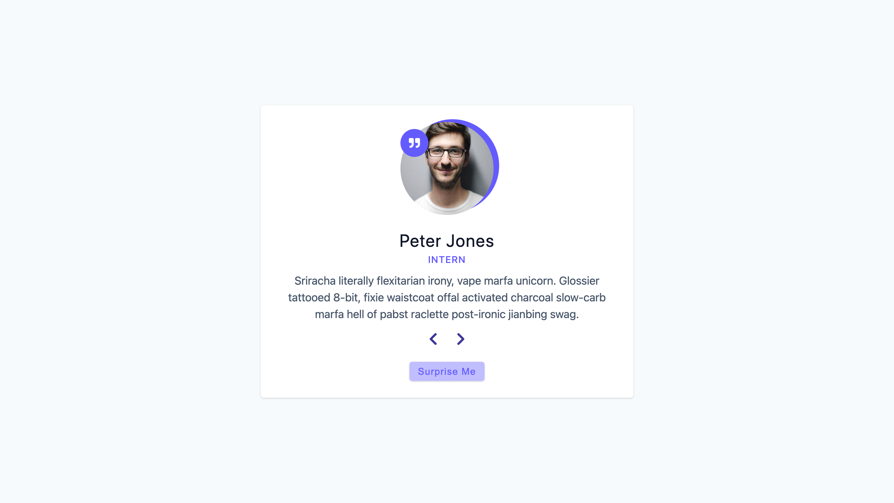
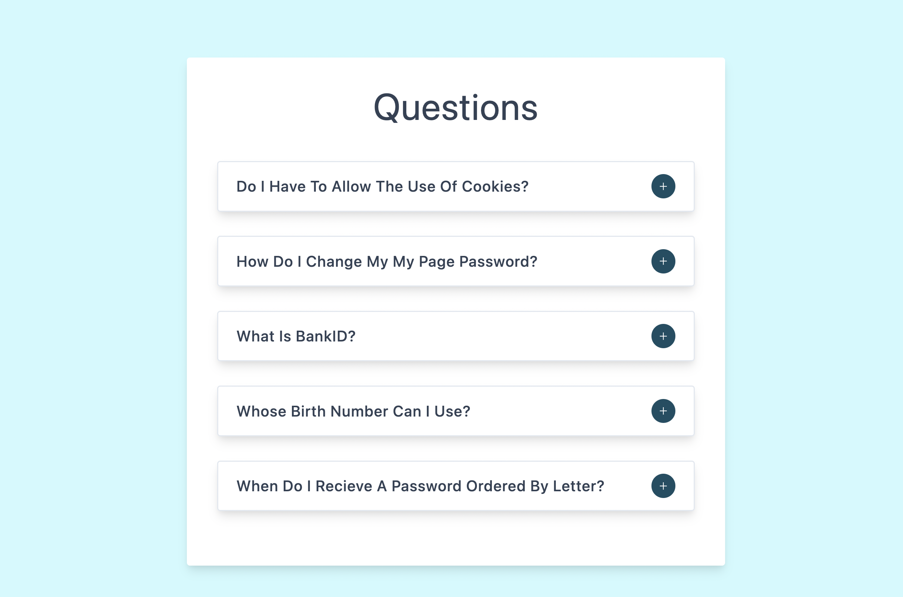
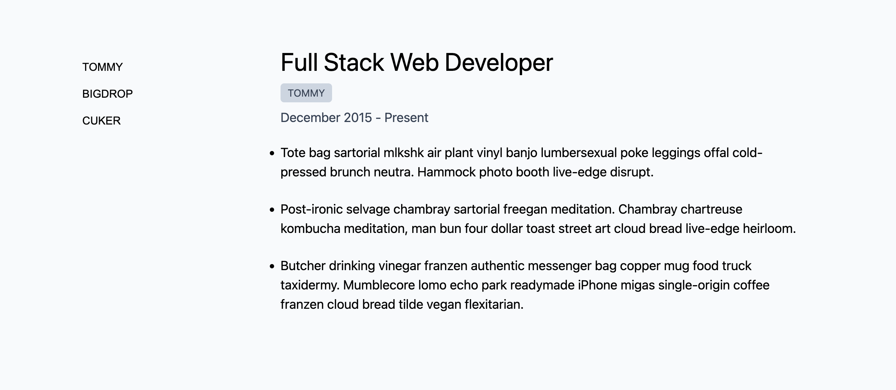
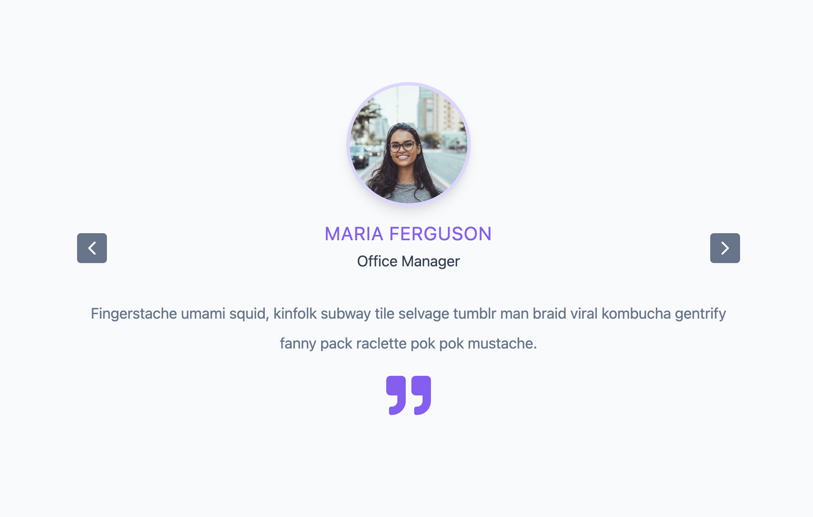
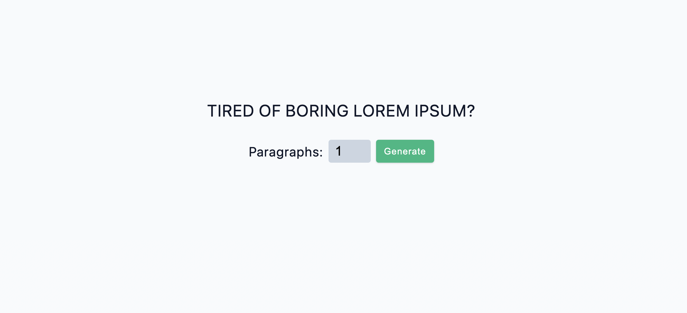
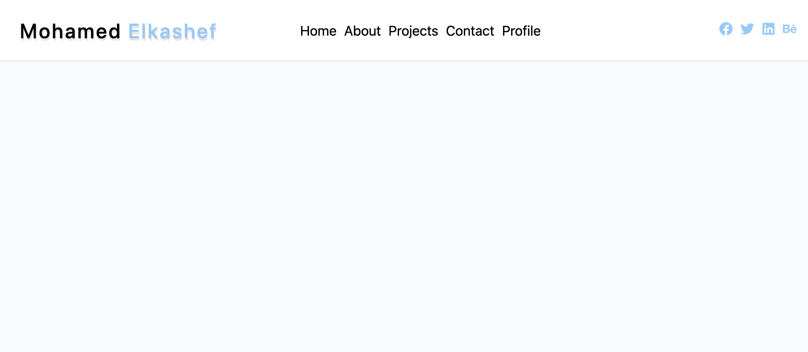

# react-small-projects

## backroads

## Tours

Project Functionality

- How to delete an item from a list
- Remove item from list when click to a button using filter
- Display loading component while fetching data
- create a read more button so when I click on it display more text
- How to re-fetch data without hard reload the page

## Reviews

Project Functionality

- Display content using fetch data
- loop through cards when click to next button
- Create a random button so when click it display a random card

## Accordion

Project Functionality

- display questions from data
- hide/show paragraph when clicking into + & - icon

## Menu

Project Functionality

- on click to menu category item display items that includes that category using filter method

## Tabs

Project Functionality

- set an array for the content while click into specific tab display different content by changing the index of the array

## Slider

Project Functionality

- onClick to left/right go prev/next by changing the index of slider
- use setTimeOut to make slider slide after certain period of time

## Lorem Ipsum

Project functionality

- When click to a form display certain number of paragraphs based on the number that are shown in the input

## 10 Navbar

Project Tasks

- show bars on small screen
  - OnClick to bars toggle (show/hide) menu
- Add transition when clicking into the bars for height

